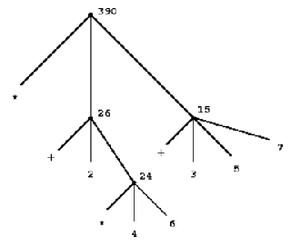
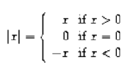

# Chapter 1
## 1.1 The Elements of Programming
Programming language serves multiple purposes.
- Means for instructing a computer to perform tasks
- Serves as a framework to organise our ideas about **processes**

We need to look at how the language combines single ideas to form more complex ones - which is done via the following:
  - **Primitive expressions** - simplest entities the language is concerned with
  - **Means of combination** - compound elements are built from simpler ones
  - **Means of abstraction** - compound elements can be named and manipulated as units

Two elements of programming:
  - **Data** - "stuff" to manipulate
  - **Procedures** - descriptions of rules for manipulating data
    - Also described as methods
    - Used for combining and abstracting procedures and data

### 1.1.1 Expressions
In Lisp, entering an **expression** into an interpreter will cause the interpreter to *evaluate the expression.*

Combining expressions representing numbers with expressions representing primitive procedures form compound expressions
- Represents the application of the procedure to those numbers
  
```lisp
(+ 21 26 12 7 35)
```

The above is an example of an expression representing the application of procedures to those numbers. 
- Formed by delimiting a list of expressions within parentheses in order
-  **Operator** - leftmost element in the list
-  **Operands** - other elements in the list
- **Value of combination** - apply procedure specified by the operator to the arguments
  - **Arguments** - value of the operands

**Prefix notation** - placing operator to the left of the operands.
- Advantages:
  - Accomodates prodecures with arbitrary number of arguments
  
    ```lisp
    (+ 21 35 12 7)
    >>> 75
    (* 25 4 12)
    >>> 1200
    ```

  - No ambiguity since operator is always the leftmost element and the entire combination is delimited by the parantheses
  - Alows combinations to be nested
  
    ```lisp
    (+ (* 3 5) (- 10 6))
    >>> 19
    ```
    - No limit to depth of nesting and to the overall complexity of the expression the Lisp interpreter can evaluate

**Pretty printing** - each long combination is written so that the operands are aligned vertically which displaythe structure of the expression.

```lisp
(+ (* 3 (+ (* 2 4) (+ 3 5))) (+ (- 10 7) 6))

(+ (* 3
      (+ (* 2 4)
         (+ 3 5)))
   (+ (- 10 7)
      6))
```

**Order of interpretation** - regardless of complexity of expression. 
- Read expression from terminal 
- Evaluate expression
- Print results
- Aka *read-eval-print loop*

### 1.1.2 Naming and the Environment
Using a name to refer to computational objects
- Name identifies a *variable* whose *value* is the object

```lisp
(define size 2)
```

That has associated the name *size* to the value 2. We can use this name to refer to the value 2 from now on. 

```lisp
size
>>> 2
(* 5 size)
>>> 10
```

*define* is the simplest means of abstraction.
- Allows the use of simple names to refer to the results of compound operations 

Due to the complex structure of computational objects, it becomes difficult to remember their details and this is where using names help.
- Through the use of names, we build larger programs from smaller procedures.

**Environment** - memory that stores the *name-value* pairs.
- The one we use now is known as the **global environment.**

### 1.1.3 Evaluating Combinations
The interpreter takes the following steps to evaluate a combination:
- Evaluate the subexpressions of the combination
- Apply the procedure that is the value of the operator to the arguments

Evaluation is *recursive* in nature, meaning that in order for the operation to occur, it must invoke itself.
- In this scenario, for evaluation to occur, it must first evaluate all expressions

```lisp
(* (+ 2 (* 4 6))
   (+ 3 5 7))
```

In the example above, the combination can be represented by a tree.
- Each combination is represented by a node with branches corresponding to the operator and the operands of the combination stemming from it
- **Terminal nodes** represent either operators or numbers
- Values of operands precolate upward
  - Moving froterminal nodes and combining at higher and higher levels
  - **Tree accumulation** - process of accumulating



Due to the recursive nature of evaluation, we end up evaluating expressions, not combinations.
- Values of numerals are the numbers that they name.
- Values of built-in operators are the machine instruction sequences that carry out the corresponding operations.
- Value of other names are the objects associaated with those names in the environment.

For the above rules of evaluation, the second rule is a special case of the third rule - the symbols +/* are stored in the global environment and are associated with the sequence of machine instructions as their *values.*

The evaluation rule does not handle definitions - instead of applying define to two arguments such as `(define x 3)`, define associates `x` to the value of 3.
- Definitions are **not** combinations
- Exception to the general evaluation rule

**Special forms** - exceptions to the general evaluation rule.
- Each special form has its own evaluation rule

### 1.1.4 Compound Procedures
**Procedure definitions** - compound operations with names and referred to as a unit

To illustrate the idea of procedure definition, we think of the procedure as an instruction:

> To square something, multiply it by itself

Then, we express that in our language as such:

```lisp
(define (square x) (* x x))
```

We have created a *compound procedure* with the name *square.*
- The procedure represents the operation of multiplying something by itself
- Thing to multiplied has the local name *x*

The general form of procedure definition is:

```lisp
(define (<name> <formal parameters>) <body>)
```

- *\<name>* - symbol to be associated with the procedure definition in the environment 
- *\<formal parameters>* - names used within the body of the procedure to refer to the corresponding arguments of the procedure
- *\<body>* - expression that yield the value of the procedure application when the formal parameters are replaced by the actual arguments to which the procedure is applied
- *\<name>* and *\<formal parameters>* are grouped within parantheses
-  As they would be in an actual call to the procedure being defined.

With *square* defined, we can now use it:

```lisp
(square 21)
>>> 441
(square (+ 2 5))
>>> 49
```

We can even use it as a building block in defining other procedures. 

```lisp
(define (sum-of-squares x y)
  (+ (square x) (square y)))

(sum-of-squares 3 4)
>>> 25
```

### 1.1.5 The Substitution Model for Procedure Application
The interpreter applies the same process as primitive procedures to procedure application.

The body of the procedure is evaluated with each formal parameter is replaced by the corresponding argument.

```lisp
(f 5)
```

And say that `f` has the following definition, it gives new meaning to the above procedure call.

```lisp
(define (f x) (sum-of-squares (+ x 1) (* x 2)))

(f 5)
(sum-of-squares (+ 5 1) (* 5 2))
```

As such, the problem is now the evaluations of a combination with two operands and an operator, `sum-of-squares`.

With the new expanded form, we evaluate the parameters to `6` and `10` respectively.

Then, after replacing `f` with its body definition of `sum-of-squares`, we will continue to substitute each procedure with its body - in this case now, we will substitute `sum-of-sqaures` with its body comprising of `square`.

```lisp
(sum-of-squares 6 10)
(+ (square 6) (square 10))
```

Then, we apply the body of `square` to obtain our final step.

```lisp
(+ (square 6) (square 10))
(+ (* 6 6) (* 10 10))
```

And now that we are left with only primitive operations, we will finally reduce it. 

```lisp
(+ 36 100)
>>> 136
```

This process applied is known as the *substitution model* for procedure application.
- Way of thinking of procedure application, not an overview of how interpreters work
- More than 1 evaluation model

#### Applicative order vs normal order
Evaluating all operators and operands and then applying the procedure to the arguments is not the only method of evaluation.

An alternative is to only evaluate operands untitheir values are needed.
- Substitute operand expressions for parameters until it obtained an expression involving only primitive operators and then perform evaluation

```lisp
(f 5)
(sum-of-squares (+ 5 1) (* 5 2))
(+ (square (+ 5 1) (* 5 2)))
(+ (* (+ 5 1) (+ 5 1)) (* (* 5 2) (* 5 2)))
(+ (* 6 6) (* 10 10))
(+ 36 100)
>>> 136
```

The thing to note with this evaluation model is that some procedures might be evaluated twice, like `(+ 5 1)` and `(* 5 2)`.

**Normal-order evaluation** - "fully expand and the reduce"
- Contrast to **applicative-order evaluation** - "evaluate the arguments and then apply"

Lisp uses applicative-order evaluation.
- Due to additional efficiency obtained from avoiding repeated evaluations of the same expressions
- Normal-order evaluation becomes much more complicated to deal with after leaving the realm of procedures that can be modelled by substitution

### 1.1.6 Conditional Expressions and Predicates
**Case analysis** - construct where we make tests and perform different operations depending on the result of said test.



For instance, the above declares the function of *absolute*. In order to replicate this in Lisp, we use a special form known as `cond`.

```lisp
(define (abs x)
  (cond ((> x 0) x)
        ((= x 0) 0
        ((< x 0) (- x)))))
```

`cond` general form:

```lisp
(cond (<p1> <e1>)
      (<p2> <e2>)
      ...
      (<pn> <en>))
```

- **Clauses** - paranthesized pairs of expressions `<p> <e>`
  - **Predicate** - *\<p>* - expresion whose value is interpreted as `true` or `false`
  - **Consequent expression** - *\<e>* - value to be given if the matching predicate is `true`
- Evaluated in order of clauses, if `p1` is false, the it moves on to `p2` and so forth
- If none of the predicates are true, the value of `cond` is undefined

Alternative for writing absolute-value procedure:

```lisp
(define (abs x)
  (cond ((< x 0) (- x))
        (else x)))
```

Expressed in English as

> If x is less than zero return -x; otherwise return x

`else` - used in place of a predicate in the final clause of a `cond`
- `cond` returns its value if all other clauses have been bypassed (all other predicates are false)

Another alternative way of writing absolute-value procedure:

```lisp
(define (abs x)
  (if (< x 0)
      (- x)
      x))
```

`if` - restricted type of conditional used when there're precisely two cases in the case analysis.
- General form:

```lisp
(if <predicate> <consequent> <alternative>)
```

- Evaluation - starts with *\<predicate>*, if `true`, return *\<consequent>*, else, return *\<alternative>*

#### Logical composition operators
Alongside `<`, `=`, `>`, there are other logical composition operators. 

##### `and` 
- Evaluates left-to-right order
- If any *\<e>* evaluates to `false`, entire expression is `false`
- If all *\<e>* evaluate to `true`, only then will expression be `true`
- Special form, not procedure

```lisp
(and <e1> ... <en>)
```

```lisp
(and (> x 5) (< x 10))
```

The above expression represents a condition that a number `x` must be in the range `5 < x < 10`.

##### `or` 
- Evaluates left-to-right order
- If any *\<e>* evaluates to `true`, the whole expression is `true`
- If all *\<e>* evaluates to `false`, the whole expression is `false`
- Special form, not procedure

```lisp
(or <e1> ... <en>)
```

```lisp
(define (>= x y)
  (or (> x y) (= x y)))
```

##### `not`
- If *\<e>* evaluates to `false`, expression is `true` and vice versa

```lisp
(not <e>)
```

### 1.1.7 Example: Square Roots by Newton's Method
Conceptually, procedures are akin to mathematical functions. However, what sets procedures apart from mathematical functions is the fact that they have to be effective.

Mathematically, we can represent the square-root function as 

> sqrt(x) = the y such that y >= 0 and sq(y) = x

However, the definition, while accurate mathematically, does not define a procedure computationally. 

```lisp
(define (sqrt x)
  (the y (and (>= y 0)
              (= (square y) x))))
```

Herein lies the contrast between (mathematical) functions and procedures is a reflection of the distinction between describing properties of things and describing how to do things.
- Also referred to as the distinction between *declarative knowledge* and *imperative knowledge.*
- In mathematics, we are concerned with declarative descriptions (what is)
- In computer science, we are concerned with imperative descriptions (how to)

Leading to the use and definition of **Newton's method of successive approximations**.

#### Newton's method of successive approximation
We start with a guess `y` for the value of the square root of a number `x`.

To obtain a better guess (closer to the actual square root), we use the following manipulations:

> Average y with x/y

This average then becomes the new guess or `y` and we continue till we hit a "good enough" criteria which would be the case where the guess is as close to the square root as possible, often within some minute fractional difference.

We represent this definition in lisp as follows: 

```lisp
(define (sqrt-iter guess x)
  (if (good-enough? guess x)
      guess
      (sqrt-iter (improve guess x)
                 x)))

(define (improve guess x)
  (average guess (/ x guess)))

(define (average x y)
  (/ (+ x y) 2))

(define (good-enough? guess x)
  (< (abs (- (square guess) x)) 0.001))

(define (sqrt x)
  (sqrt-iter 1.0 x))
```

### 1.1.8 Procedures as Black-Box Abstractions
`sqrt-iter` is recursive - procedure is defined in terms of itself.

Any large program can be dissected into parts.
- Each procedure accomplishes an identifiable task that can be used as a module in defining other procedures.
- We regard each sub-procedure as a "black box"
  - We are not concerned with *how* it works, we only care that it computes the result
  - Aka `procedural abstraction`

## Chapter 1 Exercises
### Exercise 1.1
1. 10
2. 12
3. 8
4. 3
5. 6
6. 3
7. 4
8. 19
9. false
10. 4
11. 16
12. 6
13. 16

### Exercise 1.2
Refer to `code`

### Exercise 1.3 
Refer to `code`

### Exercise 1.4
```lisp
(define (a-plus-abs-b a b)
  ((if (> b 0) + -) a b))
```

The procedure is used to add `a` and `b` together. The purpose of the `if` condition is to accomodate for negative values of `b` - effectively working with the absolute value of `b`.

For instance, if `b = -8` and `a = 9`, the predicate of the `if` condition will evaluate to `true` and so the resulting operator will be `-`. Therefore, the evaluated expression will be `(- 9 (- 8))`. When expanded to normal form `(9 - (-8) = (17)`.

### Exercise 1.5
```lisp 
(define (p) (p))

(define (test x y)
  (if (= x 0)
      0
      y))

(test 0 (p))
```

With applicative-order evaluation, the expression is first evaluated then each argument is applied - meaning that the expressions are evaluated as they appear, rather than waiting till the very end. Therefore, the expression will attempt to evaluate `p`, which in this case if a function call. Since `p` is recursive, the interpreter will be stuck in an infinite loop.

However, with normal-order evaluation, the expression is expanded first and is only evaluated when needed - meaning that the interpreter will not attempt to evaluate `(p)` before fully expanding the procedure definition of `test`. This leads to the `if` condition being evaluated first and having the expression return `0` instead of being stuck in an infinite loop.

```lisp
; Applicative-order evaluation
(test 0 (p))
(test 0 (p))
...
(test 0 (p))

; Normal-order evaluation
(test 0 (p))
(if (= 0 0)
    0
    (p))
>>> 0
```

### Exercise 1.6
```lisp
(define (new-if predicate then-clause else-clause)
  (cond (predicate then-clause)
        (else else-clause)))
```

```lisp
(define (sqrt-iter guess x)
  (new-if (good-enough? guess x)
          guess
          (sqrt-iter (improve guess x)
                      x)))
```

To understand how this new function will compute the square roots, we need to first see how the function will be evaluated. For this, we apply the **applicative-order evaluation**, the same one that lisp uses.

When we run the code in our terminal, it doesn't return anything and is instead stuck processing it. So let's investigate why. Unlike the built in if statement, `new-if` is a procedure defined by the developer. This means that when evaluating the expression, we first evaluate the arguments of `new-if` before determining what `new-if` does, and this causes it to hang because we're never actually comparing the arguments of `new-if` since the procedure will continue to recurse.

### Exercise 1.7
For small numbers, our limit is too large to allow for an accurate reading. If the guesses reach a certain limit that exceeds the built in 0.001 limit, we will get false positives that are not accurate enough enough. 

For large numbers, our limit is far too small for the system to appropriately measure the square root within a decent period of time since it will continue to refine the square root till it hits the 0.001 limit.

The solution would be to modify `good-enough?` to look at the difference between iterations.

```lisp
; Old version
(define (good-enough? guess x)
  (< (abs (- (square guess) x)) 0.001))

; New version
(define (good-enough? guess x)
  (< (abs (- (improve guess x) guess))
      (* guess 0.001)))
```

In the old version, we compare the original number to the square of the guess. However, this is too strict of a requirement for the guesses to be accurate. The new version rectifies this issue by fatoring in two key components.

1. The size of the leeway or limit
2. How much of a fit the guess was

This way, we are more flexible with the way we determine the limit for what qualifies as a `good-enough?` guess.

### Exercise 1.8
Refer to `code`